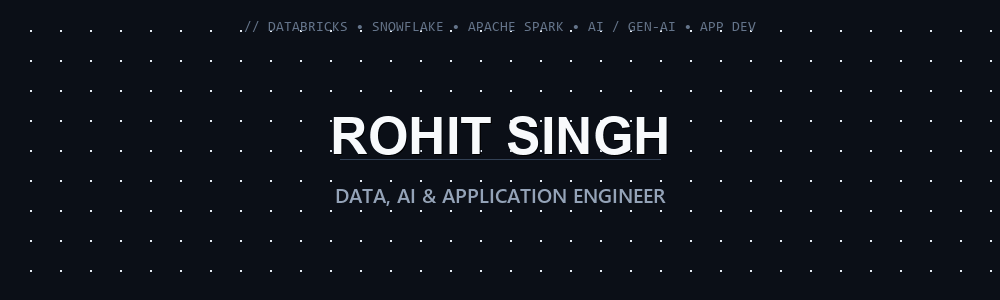

<div align="center">

<!-- MINIMALIST PROFESSIONAL ANIMATED HERO BANNER -->
<a href="https://github.com/rohitgit1">
  
</a>

<br/><br/>

<!-- ANIMATED TYPING HEADER -->
<a href="https://github.com/rohitgit1">
  
</a>

<p align="center">
  <b>Architecting Modern Data Platforms, Intelligent AI Applications & High-Performance Distributed Systems</b>
</p>

<!-- CORE HIGHLIGHT BADGES -->
<p align="center">
  
  
  
  
  
  
</p>

<!-- VISITOR & SOCIAL BADGES -->
<p align="center">
  <a href="https://github.com/rohitgit1"></a>
  <a href="https://linkedin.com"></a>
  <a href="mailto:rohit@example.com"></a>
  <a href="https://github.com/rohitgit1?tab=followers"></a>
  <a href="https://github.com/rohitgit1"></a>
</p>

</div>

---

### ⚡ Operational System Brief (`$ rohit --status`)

```bash
rohit@cluster:~$ cat profile.json
{
  "name": "Rohit Singh",
  "role": "Data, AI & Application Engineer",
  "certifications_2026": [
    "Claude Certified Architect - Professional (CCAR-P)",
    "Claude Certified Architect - Foundations (CCAR-F)",
    "Claude Certified Developer - Foundations (CCDV-F)",
    "Claude Certified Associate - Foundations (CCAO-F)",
    "Snowflake SnowPro Core Certified (COF-C02)"
  ],
  "core_stack": {
    "data_platforms": ["Databricks", "Snowflake", "Apache Spark", "Delta Lake"],
    "ai_intelligence": ["Generative AI", "LLM Fine-Tuning & RAG", "Deep Learning", "Computer Vision"],
    "engineering": ["Python", "Full-Stack Application Development", "REST APIs", "Microservices"]
  },
  "philosophy": "Building scalable data lakehouses and intelligent AI applications that solve real-world complexities.",
  "fuel": "Indian Tea / Chai over Coffee ☕"
}
```

---

### 🏆 Verified Professional Certifications (2026)

<p align="center">
  <a href="https://github.com/rohitgit1/Professional-Certifications">
    
  </a>
</p>

| Certificate Title | Code / Track | Issuer | Verification Link |
| :--- | :--- | :--- | :--- |
| **Claude Certified Architect - Professional** | `CCAR-P` | Anthropic | [Verify on Credly 🔗](https://www.credly.com/badges/05bc8519-1d82-46b1-a327-5ba90e393772) |
| **Claude Certified Architect - Foundations** | `CCAR-F` | Anthropic | [Verify on Credly 🔗](https://www.credly.com/badges/6f26916c-0066-46b2-aca2-3e2788a8e3a6) |
| **Claude Certified Developer - Foundations** | `CCDV-F` | Anthropic | [Verify on Credly 🔗](https://www.credly.com/badges/e1af33de-ab05-43d2-ba78-989f4e102cf3) |
| **Claude Certified Associate - Foundations** | `CCAO-F` | Anthropic | [Verify on Credly 🔗](https://www.credly.com/badges/afe62a8b-6093-499f-8e2d-cec9043c4bb1) |
| **Snowflake SnowPro Core Certified** | `COF-C02` | Snowflake | [Verify on Snowflake 🔗](https://achieve.snowflake.com/8cbfeb4c-6a85-4a41-8cd8-d89bf58958f9#acc.VQczvoaD) |

---

### 🛡️ Skill Arsenal & Technologies

<div align="center">

<a href="https://skillicons.dev">
  
</a>

</div>

<br/>

| Category | Specialized Stack |
| :--- | :--- |
| **📊 Data Platforms & Lakehouse** | **Databricks**, **Snowflake**, **Apache Spark**, Delta Lake, Apache Kafka, Hadoop, AWS, PostgreSQL |
| **🤖 Artificial Intelligence & GenAI** | **Generative AI**, **LLMs**, RAG, PyTorch, TensorFlow, OpenCV, Scikit-Learn, Pandas, NumPy, NLP, CNNs |
| **💻 Languages & App Development** | **Python**, C++, SQL, Java, TypeScript, JavaScript, **Full-Stack Web & App Dev**, React, Node.js |
| **🛠️ Infrastructure & DevOps** | Docker, Kubernetes, AWS Cloud, Git, GitHub Actions, Linux Shell, CI/CD Pipelines |

---

### 🚀 Flagship Data & AI Engineering Projects

<table>
  <tr>
    <td width="50%" valign="top">
      <h3 align="center">📡 Target Detection in MSTAR Images</h3>
      <p align="center">
        
      </p>
      <p>Synthetic Aperture Radar (SAR) target recognition utilizing deep learning neural networks and high-resolution signal analytics.</p>
      <p><b>Stack:</b> Python, PyTorch, OpenCV, NumPy, CNNs</p>
      <p align="center">
        <a href="https://github.com/rohitgit1/Target-Detection-in-MSTAR-Images"><b>View AI Repository »</b></a>
      </p>
    </td>
    <td width="50%" valign="top">
      <h3 align="center">⚛️ Quantum Computing Summer School</h3>
      <p align="center">
        
      </p>
      <p>IBM Qiskit Global Summer School implementations, covering quantum error mitigation, Variational Quantum Eigensolvers (VQE), and entanglement circuits.</p>
      <p><b>Stack:</b> Python, Qiskit, Quantum Circuits, Linear Algebra</p>
      <p align="center">
        <a href="https://github.com/rohitgit1/Quantum-Computing-Summer-School"><b>View Quantum Repo »</b></a>
      </p>
    </td>
  </tr>
  <tr>
    <td width="50%" valign="top">
      <h3 align="center">🤖 LetsUpgrade CHIT-CHAT Bot</h3>
      <p align="center">
        
      </p>
      <p>Intelligent NLP conversational bot engine & full application framework built to process and serve complex human queries in real-time.</p>
      <p><b>Stack:</b> Python, NLTK, Flask, Application Architecture</p>
      <p align="center">
        <a href="https://github.com/LetsUpgrade/CHIT-CHAT"><b>View Application Repo »</b></a>
      </p>
    </td>
    <td width="50%" valign="top">
      <h3 align="center">🎬 Movie Recommendation Engine</h3>
      <p align="center">
        
      </p>
      <p>Content-based filtering system computing high-dimensional vector similarities (TF-IDF & cosine distance) across film feature representations.</p>
      <p><b>Stack:</b> Python, Scikit-Learn, Pandas, Cosine Similarity</p>
      <p align="center">
        <a href="https://github.com/rohitgit1/Movie_Recommendation_System"><b>View ML Repository »</b></a>
      </p>
    </td>
  </tr>
</table>

---

### 📈 GitHub Telemetry & Verified Metrics

<p align="center">
  
</p>

<p align="center">
  
</p>

<p align="center">
  
  
</p>

---

<div align="center">

  <b>"Simplicity is prerequisite for reliability."</b> — *Edsger W. Dijkstra*

  <br/>
  
  <p align="center">
    <i>Engineered with precision for <b>Rohit Singh</b> | Data, AI & Application Engineer</i>
  </p>

</div>
